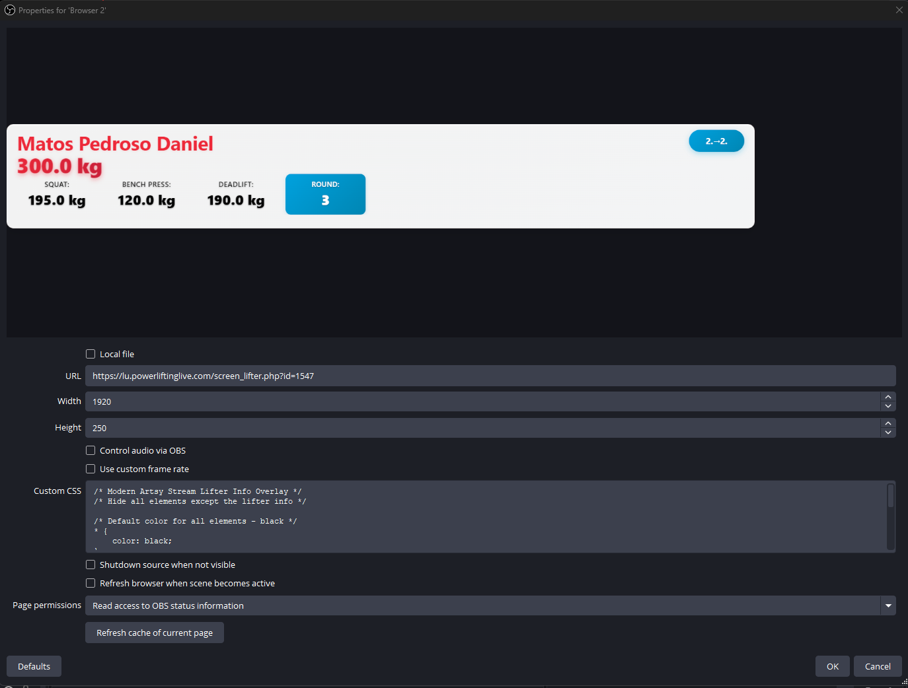

<<<<<<< HEAD
# obs-powerliftinglive-overlay
=======
# PowerliftingLive.com Stream Overlay Guide

A comprehensive guide for clubs and nations using PowerliftingLive.com to enhance their live streaming with professional overlays for powerlifting competitions.

## 📋 Table of Contents

- [Overview](#overview)
- [Prerequisites](#prerequisites)
- [Quick Start Guide](#quick-start-guide)
- [Overlay Types](#overlay-types)
- [Detailed Setup Instructions](#detailed-setup-instructions)
- [OBS Configuration](#obs-configuration)
- [Customization](#customization)
- [Troubleshooting](#troubleshooting)
- [Advanced Features](#advanced-features)
- [FAQ](#faq)
- [Support](#support)

## 🎯 Overview

This repository contains custom CSS overlays designed to enhance PowerliftingLive.com competition streams. The overlays provide real-time information about lifters, weights, and record attempts directly in your broadcast stream.

### What's Included

- **Stream Lifter Info Overlay** (`stream-lifter-info.css`) - Displays current lifter information, weights, and lift history
- **New Record Overlay** (`new-record-overlay.css`) - Highlights when a lifter is attempting a new record
- **Base Styles** (`style.css`) - Core styling foundation from Powerliftinglive
- **HTML Template** (`stream-lifter-info.html`) - Reference implementation


## 📋 Prerequisites

Before you begin, ensure you have:

- [ ] Access to a PowerliftingLive.com tenant account
- [ ] An active powerlifting competition set up on the platform
- [ ] OBS Studio (recommended) or compatible streaming software
- [ ] Basic familiarity with OBS browser sources
- [ ] Stable internet connection for real-time data feeds


## 🚀 Quick Start Guide

### Step 1: Access Your Competition

1. **Login** to your PowerliftingLive.com tenant
   ```
   https://[your-tenant].powerliftinglive.com
   ```

2. **Select Competition**
   - Navigate to your active competition
   - Ensure the competition is properly configured

3. **Access Screen Options**
   - Scroll to the bottom of the competition page
   - Click on **"New Screen"**

   
   *Location of the New Screen button at the bottom of the competition page*

### Step 2: Generate Overlay URL

1. **Select Screen Type**
   - Choose **"Screen: Lifter"** from the available options
   
   
   *Selecting the Lifter screen type*

2. **Copy the URL**
   - The system will generate a URL similar to:
   ```
   https://test.powerliftinglive.com/screen_lifter.php?id=1547
   ```
   - **Copy this URL** - you'll need it for OBS

### Step 3: Configure OBS

1. **Add Browser Source**
   - In OBS, click the **"+"** in Sources
   - Select **"Browser"**
   - Create new or add existing

2. **Configure Source**
   - **URL**: Paste your copied PowerliftingLive URL
   - **Width**: 1920 (recommended)
   - **Height**: 1080 (recommended)
   - **CSS**: Copy and paste the appropriate overlay CSS

3. **Apply Overlay Styling**
   - For lifter info: Copy `stream-lifter-info.css` content
   - For record attempts: Copy `new-record-overlay.css` content
   - Paste into the **"Custom CSS"** field

## 🎨 Overlay Types

### 1. Stream Lifter Info Overlay

**File**: `stream-lifter-info.css`

**Features**:
- Lifter name with prominent display
- Current attempt weight (large, animated)
- Lift history (Squat, Bench Press, Deadlift)
- Current round information
- Place tracking (current → predicted)
- Team logo integration
- Referee lights (hidden in overlay mode)

**Visual Design**:
- Modern glass-morphism effect
- Red accent colors (#ed2939)
- Smooth animations and transitions
- Responsive layout (1600px × 220px)

**Use Case**: Perfect for continuous display during competition

### 2. New Record Overlay

**File**: `new-record-overlay.css`

**Features**:
- "NEW RECORD ATTEMPT" header with animation
- Record category information
- Discipline-specific highlighting
- Auto-hide when no records are being attempted
- Dramatic visual effects

**Visual Design**:
- Dark gradient background with colored accents
- Pulsing and glowing animations
- High contrast for visibility
- Conditional display (only shows when relevant)

**Use Case**: Automatically appears when a lifter attempts a record

## 🔧 Detailed Setup Instructions

### PowerliftingLive.com Configuration

1. **Competition Setup**
   ```
   Competition → Settings → Display Options
   ├── Enable real-time updates
   ├── Configure referee system
   ├── Set up categories and records
   └── Test data feed
   ```

2. **Screen Generation**
   ```
   Competition Page → Bottom Section → New Screen
   ├── Screen Type: "Lifter"
   ├── Generate URL
   ├── Test in browser
   └── Copy for OBS
   ```

### OBS Studio Configuration

#### Browser Source

1. **Create Browser Source**
   ```
   Sources → Add → Browser
   ├── Name: "PowerliftingLive Overlay"
   ├── URL: [Your PowerliftingLive URL]
   ├── Width: 1920
   ├── Height: 1080
   ├── FPS: 30
   └── Custom CSS: [Paste overlay CSS]
   ```
  
   *Create Browser Source*

     
   *Create Browser Source*
2. **Position and Scale**
   ```
   Transform → Edit Transform
   ├── Position: Adjust as needed
   ├── Scale: Maintain aspect ratio
   ├── Crop: If necessary
   └── Blend Mode: Normal
   ```


### CSS Integration Options

#### Direct CSS Paste
```css
/* Copy entire contents of stream-lifter-info.css */
/* Paste into OBS Browser Source Custom CSS field */
```


## 🎛️ Customization

### Color Scheme Modification

The overlays use a consistent color palette that can be customized:

```css
/* Primary Colors */
:root {
  --primary-red: #ed2939;    
  --primary-blue: #00a1de;    /* Accent blue */
  --text-primary: #000000;    /* Main text */
  --text-light: #ffffff;      /* Light text */
  --background: rgba(255, 255, 255, 0.95); /* Overlay background */
}
```

### Layout Adjustments

#### Resize Overlay Container
```css
#container {
  width: 1600px;  /* Adjust width */
  height: 220px;  /* Adjust height */
}
```

#### Reposition Elements
```css
#next_lifter_name {
  top: 10px;      /* Vertical position */
  left: 20px;     /* Horizontal position */
}
```

#### Font Modifications
```css
#next_lifter_name {
  font-size: 42px;                    /* Size */
  font-family: 'Arial', sans-serif;   /* Font family */
  font-weight: 700;                   /* Weight */
}
```

### Animation Control

#### Disable Animations
```css
* {
  animation: none !important;
  transition: none !important;
}
```

#### Modify Animation Speed
```css
@keyframes weightPulse {
  animation-duration: 1s; /* Faster pulse */
}
```

### Team Logo Integration

The overlay supports team logos but hides them by default:

```css
/* Show team logos */
#next_lifter_team,
#next_lifter_team img {
  display: block !important;
}

/* Customize logo size */
#next_lifter_team img {
  width: 60px;
  height: 60px;
}
```

## 🛠️ Troubleshooting

### Common Issues

#### 1. Overlay Not Displaying
**Symptoms**: Blank or white screen in OBS
**Solutions**:
- ✅ Verify PowerliftingLive URL is correct
- ✅ Check internet connection
- ✅ Ensure competition is active
- ✅ Test URL in regular browser first
- ✅ Check OBS browser source settings

#### 2. CSS Not Applied
**Symptoms**: Default styling instead of overlay design
**Solutions**:
- ✅ Verify CSS is pasted correctly
- ✅ Check for syntax errors in CSS
- ✅ Clear browser cache in OBS
- ✅ Restart OBS browser source

#### 3. Data Not Updating
**Symptoms**: Static information, no real-time updates
**Solutions**:
- ✅ Check PowerliftingLive competition status
- ✅ Verify internet connection stability
- ✅ Refresh browser source
- ✅ Check firewall/proxy settings

#### 4. Layout Issues
**Symptoms**: Elements overlapping or mispositioned
**Solutions**:
- ✅ Adjust browser source dimensions
- ✅ Modify CSS positioning values
- ✅ Check screen resolution settings
- ✅ Test on different screen sizes

### Performance Optimization

#### Reduce Resource Usage
```css
/* Disable expensive effects */
.heavy-animation {
  animation: none;
  backdrop-filter: none;
  box-shadow: none;
}
```

#### Optimize for Lower-End Systems
```css
/* Simplified styling */
#container {
  background: rgba(255, 255, 255, 0.9);
  box-shadow: 0 2px 4px rgba(0, 0, 0, 0.1);
}
```

### Debug Mode

Enable debug information by adding to CSS:

```css
/* Debug overlay borders */
* {
  border: 1px solid red !important;
}

/* Show hidden elements */
#plive_connection_problems {
  display: block !important;
}
```

### Custom Animations

#### Entrance Effects
```css
@keyframes slideInFromLeft {
  from { transform: translateX(-100%); }
  to { transform: translateX(0); }
}

#next_lifter_name {
  animation: slideInFromLeft 0.5s ease-out;
}
```

#### Attention-Grabbing Effects
```css
@keyframes urgentPulse {
  0%, 100% { 
    background-color: #ed2939;
    transform: scale(1);
  }
  50% { 
    background-color: #ff6b6b;
    transform: scale(1.05);
  }
}
```

### Integration with Other Tools

#### StreamLabs Integration
- Use the same PowerliftingLive URL
- Apply CSS through StreamLabs browser source
- Configure alerts and notifications

#### XSplit Integration
- Add as web source
- Apply custom CSS styling
- Position within scene composition

```
---

## 📄 License

This project is provided as-is for use with PowerliftingLive.com. Modify and distribute according to your needs.

>>>>>>> master
